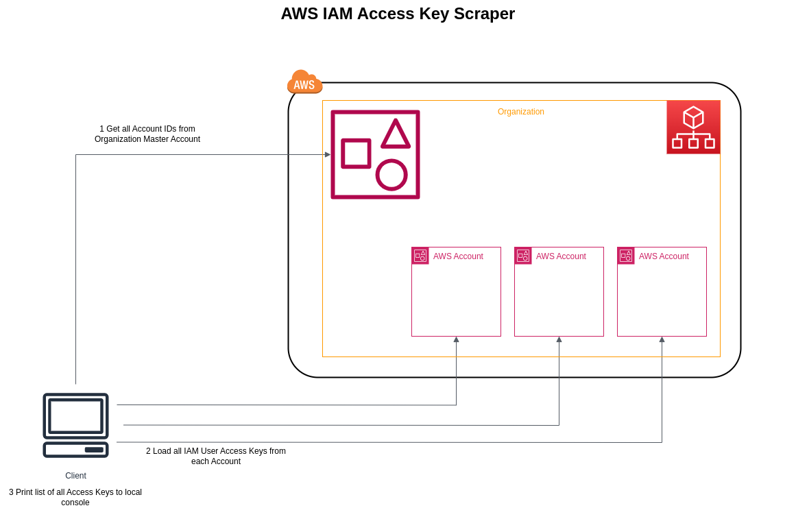

# AWS IAM AccessKey scraper

## Overview

This AWS IAM scraper collects Access Key metadata from all AWS accounts in your organization.

For this it 
1. Assumes a role in your organization master account to read a list of all account ids
2. Assumes a role in each account to collect all access key metadata (user name, access key id, creation date)
3. Prints everything out to the local console



## How to build

To build this tool you need
* JDK 17+ installed with JAVA_HOME configured appropriately 
* Apache Maven 3.9.6
* Optionally Docker

## How to install

1. Deploy CloudFormation template cloudformation/cf-organizationreader-role.yaml to your master account. UserARN is the arn of your local user.
2. Deploy cfstackset-iamscraper-role.yaml as a stackset to all your AWS accounts. UserARN is the arn of your local user.

To get the ARN of your local user run
```shell script
aws sts get-caller-identity
```
and use this ARN for the CloudFormation UserARN parameter.

## How to run

1. Set AWS_ORGANIZATION_ACCOUNT_ID environment variable to your master account
2. Configure AWS_ACCESS_KEY_ID, AWS_SECRET_ACCESS_KEY, AWS_SESSION_TOKEN environment variables

### Run in Docker with a prebuilt image

```shell script
docker run -e AWS_ORGANIZATION_ACCOUNT_ID=${AWS_ORGANIZATION_ACCOUNT_ID}  -e AWS_REGION=us-east-1 -e AWS_ACCESS_KEY_ID=$AWS_ACCESS_KEY_ID -e AWS_SECRET_ACCESS_KEY=$AWS_SECRET_ACCESS_KEY -e AWS_SESSION_TOKEN=$AWS_SESSION_TOKEN --name AwsIamScraper --rm haraldlandvoigt/awsiamscraper:latest
```
### Running the application in dev mode

You can run your application in dev mode that enables live coding using:
```shell script
mvn compile quarkus:dev
```
### Packaging and running the application

The application can be packaged using:
```shell script
mvn package
```
It produces the `quarkus-run.jar` file in the `target/quarkus-app/` directory.
Be aware that it’s not an _über-jar_ as the dependencies are copied into the `target/quarkus-app/lib/` directory.

The application is now runnable using `java -jar target/quarkus-app/quarkus-run.jar`.

If you want to build an _über-jar_, execute the following command:
```shell script
mvn package -Dquarkus.package.type=uber-jar
```
The application, packaged as an _über-jar_, is now runnable using `java -jar target/*-runner.jar`.

## Creating a native executable

You can create a native executable using:
```shell script
mvn package -Dnative
```

Or, if you don't have GraalVM installed, you can run the native executable build in a container using:
```shell script
mvn package -Dnative -Dquarkus.native.container-build=true
```

You can then execute your native executable with: `./target/iamscraper-1.0.0-SNAPSHOT-runner`

If you want to learn more about building native executables, please consult https://quarkus.io/guides/maven-tooling.


